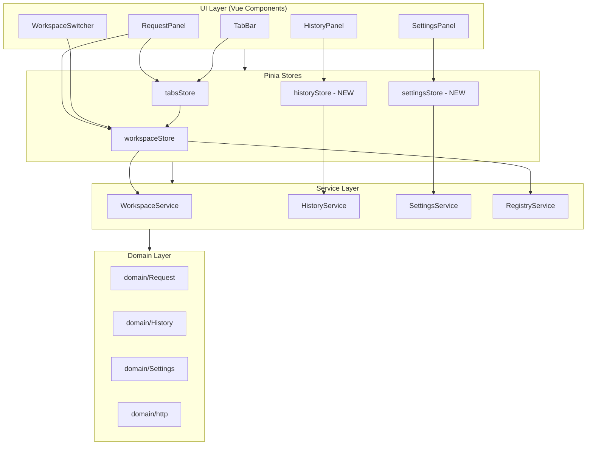
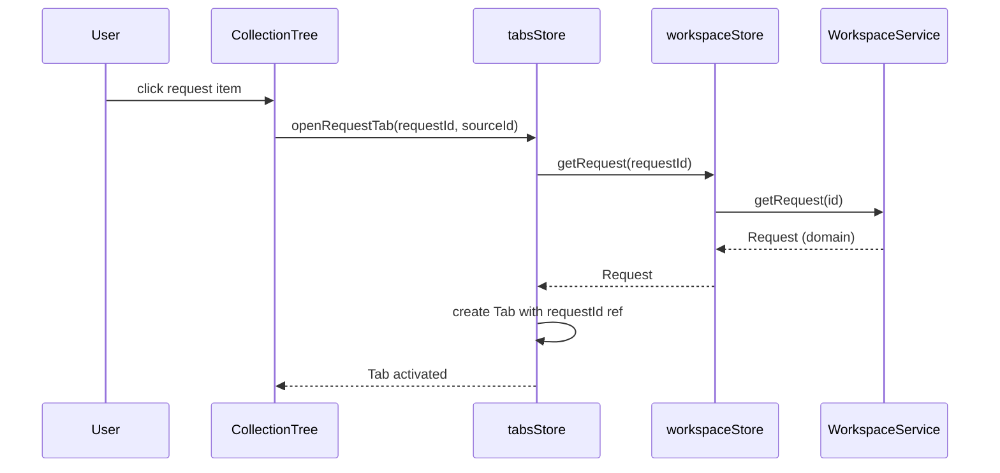
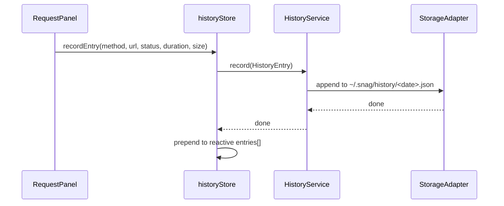
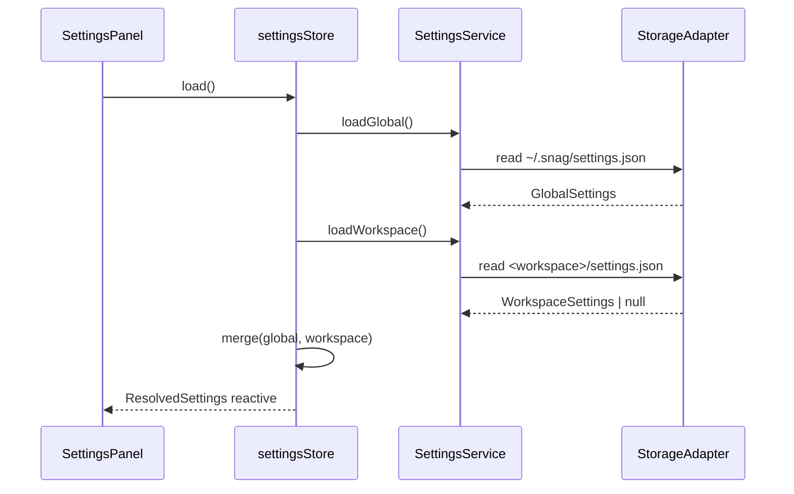
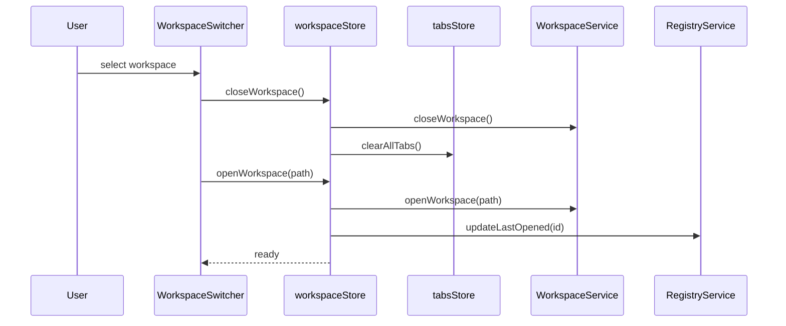

# Design Document: Workspace Architecture Completion

## Overview

This feature completes the migration from Snag's legacy v0 architecture (single-file storage, enum-based types, flat settings) to the workspace-based v1 architecture. The migration spans five phases: (1) replacing all `src/types/` imports with `src/domain/` equivalents, (2) migrating the history store to HistoryService, (3) migrating the settings store to the layered SettingsService, (4) building a workspace switcher UI, and (5) removing the legacy `useStorage` composable.

The core challenge is that the legacy `Tab` interface embeds a full `RequestConfig` (with `id: UUID`, `HttpMethod` enum, `KeyValuePair` with `id` field) while the new domain uses immutable `Request` objects with branded IDs and `KeyValuePair` without `id`. The tab system needs to become a thin reference layer that lazy-loads requests from `workspaceStore` rather than embedding full request data.

The migration must be incremental — each phase produces a build-passing state (`vue-tsc --noEmit` + `vite build`). No big-bang rewrite.

## Architecture



## Sequence Diagrams

### Tab Open → Lazy Request Load



### History Recording (New Flow)



### Settings Load (Layered Merge)



### Workspace Switch



## Components and Interfaces

### Component 1: Refactored Tab Interface

**Purpose**: Replace embedded `RequestConfig` with a lazy reference to workspace request data.

```typescript
interface Tab {
  readonly id: string
  readonly type: 'request' | 'settings' | 'environments'
  title: string
  protocol: ProtocolType
  /** Reference to the persisted request (lazy-loaded from workspace) */
  requestId?: RequestId
  /** Runtime editing state — mutable working copy of the domain Request */
  requestDraft?: RequestDraft
  /** Response from last send (runtime only, not persisted) */
  response?: ResponseData | null
  isDirty: boolean
  /** Links this tab to a collection item (collectionId:itemId) */
  sourceId?: string
  /** Collection-level variables (resolved from source collection) */
  collectionVariables?: { key: string; value: string }[]
}
```

**Responsibilities**:
- Hold reference to request (not full data)
- Track dirty state via snapshot comparison
- Store runtime response data (transient)

### Component 2: RequestDraft (Mutable Working Copy)

**Purpose**: Bridge between immutable domain `Request` and mutable UI editing needs.

```typescript
interface RequestDraft {
  name: string
  protocol: ProtocolType
  method: HttpMethod
  url: string
  headers: KeyValuePairEditable[]
  params: KeyValuePairEditable[]
  body: RequestBodyDraft
  auth: RequestAuthDraft
  preRequest: string
  tests: string
}

/** Editable KV pair — adds `id` for Vue list rendering (v-for :key) */
interface KeyValuePairEditable {
  readonly id: string  // nanoid for :key, NOT persisted
  key: string
  value: string
  enabled: boolean
  description?: string
}

interface RequestBodyDraft {
  type: BodyType
  content: string
  formData?: KeyValuePairEditable[]
  binaryPath?: string
}

interface RequestAuthDraft {
  type: AuthType
  basic?: { username: string; password: string }
  bearer?: { token: string }
  apiKey?: { key: string; value: string; in: 'header' | 'query' }
}
```

**Responsibilities**:
- Provide mutable state for UI two-way binding
- Add `id` field to KV pairs for Vue list rendering
- Convert to/from immutable domain `Request` on load/save

### Component 3: Refactored historyStore

**Purpose**: Replace legacy historyStore (full request/response snapshot, useStorage) with service-backed store.

```typescript
interface HistoryStoreState {
  entries: HistoryEntry[]  // domain HistoryEntry (summary only)
  isLoading: boolean
  filter: HistoryFilter
}

interface HistoryStoreActions {
  load(): Promise<void>
  recordEntry(params: {
    method: HttpMethod
    url: string
    status: number
    duration: number
    responseSize: number
    requestId?: RequestId
  }): Promise<void>
  query(filter?: HistoryFilter): Promise<void>
  removeEntry(id: HistoryEntryId): Promise<void>
  clearHistory(): Promise<void>
}
```

**Responsibilities**:
- Delegate persistence to HistoryService
- Store summary entries (no full request/response blob)
- Support filtering by method, URL, date range
- Provide reactive state for HistoryPanel

### Component 4: Refactored settingsStore

**Purpose**: Replace flat AppSettings with layered global + workspace settings.

```typescript
interface SettingsStoreState {
  global: GlobalSettings
  workspace: WorkspaceSettings | null
  resolved: ResolvedSettings
  isLoading: boolean
}

interface SettingsStoreActions {
  load(): Promise<void>
  updateGlobal(partial: Partial<GlobalSettings>): Promise<void>
  updateWorkspace(partial: Partial<WorkspaceSettings>): Promise<void>
  resetGlobal(): Promise<void>
  reloadWorkspaceSettings(): Promise<void>
}
```

**Responsibilities**:
- Delegate to SettingsService for persistence
- Merge global + workspace settings reactively
- Expose scope indicators for UI
- Reload workspace settings on workspace switch

### Component 5: WorkspaceSwitcher UI

**Purpose**: Allow users to switch between workspaces, create new ones, or open existing folders.

```typescript
interface WorkspaceSwitcherProps {
  // Rendered in sidebar header
}

interface WorkspaceSwitcherEmits {
  (e: 'switch', path: string): void
  (e: 'create', name: string, path: string): void
  (e: 'open'): void  // trigger folder picker
}
```

**Responsibilities**:
- Display current workspace name in sidebar header
- Show dropdown with recent workspaces (from RegistryService)
- Actions: Switch, Create New, Open Folder
- Handle workspace close → open transition

## Data Models

### Domain Types (already exist, shown for reference)

```typescript
// src/domain/http.ts — string union types (NOT enums)
type HttpMethod = 'GET' | 'POST' | 'PUT' | 'PATCH' | 'DELETE' | 'HEAD' | 'OPTIONS'
type ProtocolType = 'rest' | 'websocket' | 'graphql' | 'grpc'

interface KeyValuePair {
  readonly key: string
  readonly value: string
  readonly enabled: boolean
  readonly description?: string
}

// src/domain/Request.ts
interface Request {
  readonly id: RequestId
  readonly name: string
  readonly protocol: ProtocolType
  readonly method: HttpMethod
  readonly url: string
  readonly headers: readonly KeyValuePair[]
  readonly params: readonly KeyValuePair[]
  readonly body: RequestBody
  readonly auth: RequestAuth
  readonly preRequest: string
  readonly tests: string
  readonly meta: RequestMeta
}

// src/domain/History.ts — summary only
interface HistoryEntry {
  readonly id: HistoryEntryId
  readonly workspaceId: WorkspaceId | null
  readonly requestId: RequestId | null
  readonly timestamp: string
  readonly method: HttpMethod
  readonly url: string
  readonly status: number
  readonly duration: number
  readonly responseSize: number
}

// src/domain/Settings.ts
interface GlobalSettings {
  readonly theme: 'light' | 'dark' | 'system'
  readonly fontSize: number
  readonly fontFamily: string
  readonly language: string
}

interface WorkspaceSettings {
  readonly proxy?: ProxyConfig
  readonly defaultHeaders?: readonly { readonly key: string; readonly value: string }[]
  readonly timeout?: number
  readonly followRedirects?: boolean
  readonly validateSsl?: boolean
}
```

### Type Mapping: Legacy → Domain

| Legacy (`src/types/`) | Domain (`src/domain/`) | Key Difference |
|---|---|---|
| `HttpMethod` (enum) | `HttpMethod` (string union) | No `.GET` syntax, use `'GET'` literal |
| `ProtocolType` (enum) | `ProtocolType` (string union) | No `.REST` syntax, use `'rest'` literal |
| `KeyValuePair` (has `id: UUID`) | `KeyValuePair` (no `id`) | UI needs separate `:key` strategy |
| `RequestConfig` (mutable, flat) | `Request` (immutable, branded ID) | Needs draft layer for editing |
| `ResponseData` | `ResponseData` (keep as-is in tabs) | Runtime-only, no domain equivalent |
| `UUID` (type alias) | `RequestId`, `CollectionId` etc. (branded) | Type-safe, no accidental mixing |
| `BodyType` (`'form-data'`, `'x-www-form-urlencoded'`, `'raw'`) | `BodyType` (`'formdata'`, `'urlencoded'`, `'text'`, `'json'`, `'xml'`) | Renamed variants |
| `AuthConfig` (has `addTo`) | `RequestAuth` (has `in`) | Field rename |

### ResponseData (remains runtime-only, moved to domain-adjacent)

```typescript
// src/domain/http.ts (new addition)
interface ResponseData {
  readonly status: number
  readonly statusText: string
  readonly headers: Record<string, string>
  readonly body: string
  readonly size: number
  readonly time: number
  readonly requestHeaders?: Record<string, string>
  readonly requestUrl?: string
  readonly requestMethod?: string
}
```

**Validation Rules**:
- `status` is integer 100-599
- `time` is non-negative (milliseconds)
- `size` is non-negative (bytes)

## Algorithmic Pseudocode

### Draft Conversion Algorithm

```typescript
/**
 * Convert immutable domain Request to mutable RequestDraft for UI editing.
 */
function requestToDraft(request: Request): RequestDraft {
  return {
    name: request.name,
    protocol: request.protocol,
    method: request.method,
    url: request.url,
    headers: request.headers.map(kv => ({
      id: nanoid(),  // ephemeral ID for Vue :key
      key: kv.key,
      value: kv.value,
      enabled: kv.enabled,
      description: kv.description,
    })),
    params: request.params.map(kv => ({
      id: nanoid(),
      key: kv.key,
      value: kv.value,
      enabled: kv.enabled,
      description: kv.description,
    })),
    body: {
      type: request.body.type,
      content: request.body.content,
      formData: request.body.formData?.map(kv => ({
        id: nanoid(),
        key: kv.key,
        value: kv.value,
        enabled: kv.enabled,
        description: kv.description,
      })),
      binaryPath: request.body.binaryPath,
    },
    auth: { ...request.auth },
    preRequest: request.preRequest,
    tests: request.tests,
  }
}

/**
 * Convert mutable RequestDraft back to immutable domain Request.
 * Strips ephemeral IDs, applies readonly.
 */
function draftToRequest(draft: RequestDraft, originalId: RequestId, meta: RequestMeta): Request {
  return {
    id: originalId,
    name: draft.name,
    protocol: draft.protocol,
    method: draft.method,
    url: draft.url,
    headers: draft.headers
      .filter(kv => kv.key || kv.value)  // strip empty rows
      .map(({ key, value, enabled, description }) => ({ key, value, enabled, description })),
    params: draft.params
      .filter(kv => kv.key || kv.value)
      .map(({ key, value, enabled, description }) => ({ key, value, enabled, description })),
    body: {
      type: draft.body.type,
      content: draft.body.content,
      formData: draft.body.formData
        ?.filter(kv => kv.key || kv.value)
        .map(({ key, value, enabled, description }) => ({ key, value, enabled, description })),
      binaryPath: draft.body.binaryPath,
    },
    auth: draft.auth as RequestAuth,
    preRequest: draft.preRequest,
    tests: draft.tests,
    meta: { ...meta, updatedAt: new Date().toISOString() },
  }
}
```

**Preconditions:**
- `request` is a valid domain Request (all readonly fields present)
- `originalId` is the RequestId from the original Request (preserved on save)

**Postconditions:**
- `requestToDraft` returns a fully mutable object suitable for Vue v-model binding
- `draftToRequest` strips empty KV rows and ephemeral IDs
- Round-trip preserves data: `draftToRequest(requestToDraft(r), r.id, r.meta)` ≈ `r` (modulo empty rows, updatedAt)

### Dirty State Detection

```typescript
/**
 * Dirty = draft differs from saved snapshot.
 * Uses deep comparison (not reference equality) because draft is mutable.
 */
function isDirty(draft: RequestDraft, snapshot: RequestDraft): boolean {
  return JSON.stringify(stripEmptyRows(draft)) !== JSON.stringify(stripEmptyRows(snapshot))
}

function stripEmptyRows(draft: RequestDraft): RequestDraft {
  return {
    ...draft,
    headers: draft.headers.filter(kv => kv.key || kv.value),
    params: draft.params.filter(kv => kv.key || kv.value),
    body: {
      ...draft.body,
      formData: draft.body.formData?.filter(kv => kv.key || kv.value),
    },
  }
}
```

### Settings Merge Algorithm

```typescript
/**
 * Merge global + workspace settings.
 * Workspace values override global where present.
 */
function mergeSettings(global: GlobalSettings, workspace: WorkspaceSettings | null): ResolvedSettings {
  return {
    // Global-only fields
    theme: global.theme,
    fontSize: global.fontSize,
    fontFamily: global.fontFamily,
    language: global.language,
    // Workspace-overridable fields (with defaults from global behavior)
    proxy: workspace?.proxy ?? undefined,
    defaultHeaders: workspace?.defaultHeaders ?? undefined,
    timeout: workspace?.timeout ?? 30,
    followRedirects: workspace?.followRedirects ?? true,
    validateSsl: workspace?.validateSsl ?? true,
  }
}
```

### History Migration Strategy

```typescript
/**
 * One-time migration: convert legacy history entries (full request/response)
 * to domain HistoryEntry (summary only).
 *
 * Run at startup if legacy history.json exists in AppData.
 */
async function migrateLegacyHistory(
  legacyEntries: LegacyHistoryEntry[],
  historyService: HistoryService,
  workspaceId: WorkspaceId | null,
): Promise<void> {
  for (const legacy of legacyEntries) {
    const entry: HistoryEntry = {
      id: legacy.id as HistoryEntryId,
      workspaceId,
      requestId: null,  // legacy didn't track this
      timestamp: legacy.timestamp,
      method: legacy.request.method as HttpMethod,
      url: legacy.request.url,
      status: legacy.response?.status ?? 0,
      duration: legacy.response?.time ?? 0,
      responseSize: legacy.response?.size ?? 0,
    }
    await historyService.record(entry)
  }
}
```

## Key Functions with Formal Specifications

### Function: openRequestTab (refactored)

```typescript
function openRequestTab(
  requestId: RequestId,
  sourceId: string,
  title?: string,
): Tab
```

**Preconditions:**
- `requestId` is a valid RequestId that exists in workspace
- `sourceId` format is `collectionId:requestId`

**Postconditions:**
- If tab with same `sourceId` exists → activates existing tab (no new tab)
- Otherwise → creates new Tab with `requestId` reference
- `tab.requestDraft` is initially `undefined` (lazy-loaded on first render)
- Returns the activated or newly created Tab

### Function: loadTabDraft

```typescript
async function loadTabDraft(tabId: string): Promise<void>
```

**Preconditions:**
- Tab with `tabId` exists in `tabs[]`
- Tab has a `requestId` set

**Postconditions:**
- `tab.requestDraft` is populated from `workspaceStore.getRequest(requestId)`
- A snapshot is stored for dirty detection
- If request not found → tab marked as error state

### Function: saveTab (refactored)

```typescript
async function saveTab(tabId: string): Promise<boolean>
```

**Preconditions:**
- Tab exists, has `requestDraft` and `requestId`
- Tab is dirty

**Postconditions:**
- Converts draft to domain Request via `draftToRequest()`
- Calls `workspaceStore.saveRequest(request)`
- Updates snapshot to current draft
- Marks tab as clean (`isDirty = false`)
- Returns `true` on success, `false` on failure

### Function: recordHistory

```typescript
async function recordHistory(params: {
  method: HttpMethod
  url: string
  status: number
  duration: number
  responseSize: number
  requestId?: RequestId
}): Promise<void>
```

**Preconditions:**
- `method` is valid HttpMethod string
- `url` is non-empty string
- `status` is integer > 0

**Postconditions:**
- New HistoryEntry created with ULID id and current timestamp
- Entry includes current workspaceId from workspaceStore
- Entry persisted to today's history file via HistoryService
- Reactive `entries[]` updated (prepended)

## Example Usage

```typescript
// Opening a request from collection tree
const tab = tabsStore.openRequestTab(request.id, `${collectionId}:${request.id}`, request.name)

// Lazy-loading the draft when tab becomes active
await tabsStore.loadTabDraft(tab.id)

// UI editing (two-way binding with draft)
tab.requestDraft!.url = 'https://api.example.com/users'
tab.requestDraft!.method = 'POST'
tab.requestDraft!.headers.push({ id: nanoid(), key: 'Content-Type', value: 'application/json', enabled: true })

// Saving
await tabsStore.saveTab(tab.id)

// Recording history after send
await historyStore.recordEntry({
  method: 'POST',
  url: 'https://api.example.com/users',
  status: 201,
  duration: 245,
  responseSize: 1024,
  requestId: tab.requestId,
})

// Loading settings (layered)
await settingsStore.load()
console.log(settingsStore.resolved.theme)       // from global
console.log(settingsStore.resolved.timeout)      // from workspace (or default)

// Switching workspace
await workspaceStore.closeWorkspace()
await workspaceStore.openWorkspace('/path/to/other-workspace')
await settingsStore.reloadWorkspaceSettings()
```

## Correctness Properties

*A property is a characteristic or behavior that should hold true across all valid executions of a system — essentially, a formal statement about what the system should do. Properties serve as the bridge between human-readable specifications and machine-verifiable correctness guarantees.*

### Property 1: Round-Trip Conversion Integrity

*For any* valid Domain_Request, converting to RequestDraft (with ephemeral IDs) then back to Domain_Request (stripping IDs and empty rows) SHALL produce an equivalent object with all meaningful data preserved (modulo updatedAt timestamp).

**Validates: Requirements 2.4, 2.1, 2.2, 2.3, 11.1, 11.2, 11.3**

### Property 2: Dirty State Detection Correctness

*For any* RequestDraft and Snapshot pair, the isDirty computation SHALL return true if and only if the drafts differ after stripping empty key-value rows (rows where both key and value are empty strings).

**Validates: Requirements 3.2, 3.4**

### Property 3: Tab Deduplication by SourceId

*For any* sequence of openRequestTab calls with the same sourceId, the tabs list SHALL contain exactly one Tab with that sourceId, regardless of how many times the open operation is invoked.

**Validates: Requirements 1.2**

### Property 4: History Entry Completeness

*For any* completed request execution, the resulting HistoryEntry SHALL contain a valid method, non-empty URL, integer status, non-negative duration, non-negative responseSize, the current workspaceId, and a valid ISO timestamp.

**Validates: Requirements 5.1**

### Property 5: History Ordering

*For any* sequence of recorded history entries, the entries list SHALL be ordered with the most recently recorded entry first (descending by insertion time).

**Validates: Requirements 5.3**

### Property 6: History Filter Correctness

*For any* set of history entries and a filter (by method, URL pattern, or date range), the filtered result SHALL contain only entries that match all specified filter criteria, and SHALL contain all entries that match.

**Validates: Requirements 5.4**

### Property 7: Legacy History Migration

*For any* legacy history entry containing full request/response data, migration SHALL produce a domain HistoryEntry containing only the summary fields (method, URL, status, duration, responseSize) with no request body, response body, or header data.

**Validates: Requirements 6.1, 6.2**

### Property 8: Settings Merge Correctness

*For any* combination of GlobalSettings and WorkspaceSettings, the merge function SHALL: (a) assign global-only fields from GlobalSettings, (b) assign workspace-overridable fields from WorkspaceSettings when present, (c) use defined defaults when workspace fields are absent, and (d) produce the same output when called multiple times with the same inputs (idempotence).

**Validates: Requirements 7.2, 8.1, 8.2, 8.3, 8.4**

### Property 9: Workspace Isolation on Switch

*For any* workspace close operation, the tabs list SHALL be empty and the request cache SHALL be cleared, ensuring no stale data from the previous workspace persists.

**Validates: Requirements 9.2**

## Error Handling

### Error Scenario 1: Request Not Found on Tab Load

**Condition**: Tab references a `requestId` that no longer exists on disk (deleted externally, corrupted workspace).
**Response**: Set tab to error state, display "Request not found" message in panel, offer to close tab.
**Recovery**: User closes tab or creates a new request from scratch.

### Error Scenario 2: Workspace Switch Failure

**Condition**: Target workspace path doesn't exist or manifest is corrupted.
**Response**: Keep current workspace open. Show error toast. Mark stale entry in registry.
**Recovery**: RegistryService.validatePaths() marks missing workspaces. User can remove stale entries.

### Error Scenario 3: History Write Failure

**Condition**: Cannot write to `~/.snag/history/` (permissions, disk full).
**Response**: Log error to console. Do not block request flow. History entry lost (non-critical).
**Recovery**: Next successful write continues normally. No retry for lost entries.

### Error Scenario 4: Settings File Corruption

**Condition**: JSON parse error on settings.json (global or workspace).
**Response**: Fall back to defaults for that layer. Log warning.
**Recovery**: Next save overwrites corrupted file with valid JSON.

## Testing Strategy

### Unit Testing Approach

- **Draft conversion**: Test `requestToDraft` and `draftToRequest` round-trip for all body types, auth types
- **Dirty detection**: Test that empty row additions don't trigger dirty, actual changes do
- **Settings merge**: Test all override combinations (workspace field present/absent)
- **History migration**: Test legacy entry → domain entry conversion

### Property-Based Testing Approach

**Property Test Library**: fast-check (already available in workspace)

- **Property**: For any valid domain Request, `draftToRequest(requestToDraft(r), r.id, r.meta)` produces a Request with identical meaningful content
- **Property**: For any GlobalSettings + WorkspaceSettings combination, mergeSettings is idempotent and respects override priority
- **Property**: History entries are always ordered by timestamp (most recent first) after any sequence of record operations

### Integration Testing Approach

- **Tab lifecycle**: Open → edit → dirty → save → clean → close (full cycle)
- **Workspace switch**: Open workspace A → edit → switch to B → verify A state cleared → switch back to A → verify fresh load
- **Settings scope**: Change global theme → verify all workspaces see it. Change workspace timeout → verify only that workspace affected.

## Performance Considerations

- **Lazy loading**: Tabs only load request draft when activated (not on workspace open). For workspaces with 50+ open tabs, this prevents startup bottleneck.
- **Request cache**: workspaceStore already caches loaded requests in `shallowRef<Map>`. Draft creation reads from cache.
- **History pagination**: HistoryService supports `limit` + `offset`. UI loads 50 entries initially, loads more on scroll.
- **Settings debounce**: Both global and workspace settings saves are debounced (300ms) to avoid excessive disk writes during slider/toggle interactions.
- **Snapshot comparison**: Using `JSON.stringify` for dirty check is O(n) but acceptable for typical request sizes (<10KB). If profiling shows issues, switch to deep-equal library.

## Security Considerations

- **No secrets in history**: History entries only store method, URL, status — never headers, body, or auth tokens.
- **Workspace path validation**: On open, validate path doesn't traverse outside expected boundaries (no `../` in paths registered in workspace.json).
- **Settings file permissions**: Global settings at `~/.snag/` inherit user's home directory permissions. No world-readable secrets stored there.

## Dependencies

- **nanoid** (or crypto.randomUUID): For generating ephemeral KV pair IDs in UI. Already using crypto.randomUUID — can continue with that.
- **No new external dependencies required**: All needed services (WorkspaceService, HistoryService, SettingsService, RegistryService) are already implemented.
- **Tauri plugins**: `@tauri-apps/plugin-fs` (existing), `@tauri-apps/plugin-dialog` (existing, for folder picker in workspace switcher).
