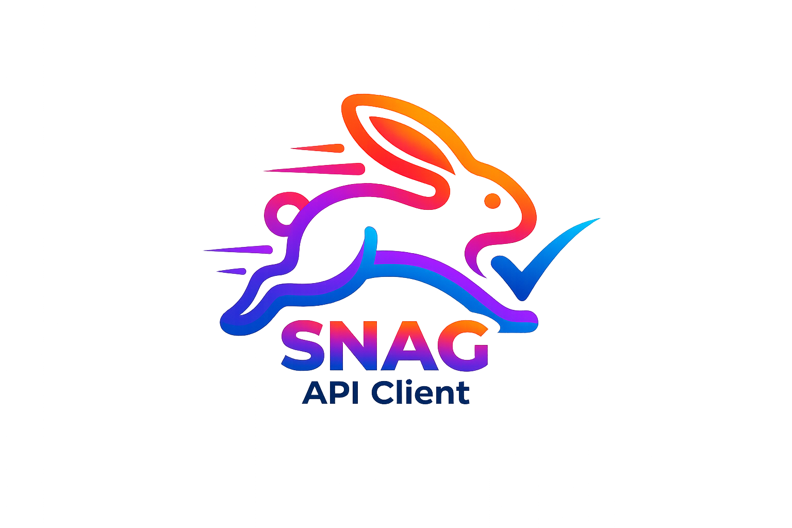

<p align="center">
  
</p>

<h1 align="center">Snag</h1>

<p align="center">
A fast, lightweight native API client built with Tauri 2, Vue 3, and TypeScript.
</p>

<p align="center">
  Think <strong>Postman</strong>, but native and snappy.
</p>

<p align="center">
  
  
  
  
  
  
</p>

<p align="center">
  
  
</p>

<p align="center">
  ⚡ Native • 🚀 Fast • 💾 Local First • 🔥 Zero Electron
</p>

---

# Snag

A fast, lightweight API client built with Tauri + Vue. Think Postman, but native and snappy.

## Tech Stack

| Layer | Tech |
|-------|------|
| Runtime | Tauri 2 |
| Frontend | Vue 3 (Composition API) |
| Language | TypeScript (strict) |
| Styling | Tailwind CSS 4 |
| State | Pinia |
| Build | Vite 6 |
| HTTP | @tauri-apps/plugin-http |
| Storage | JSON files via @tauri-apps/plugin-fs |

## Features

- **Request Builder** — method, URL, headers, params, body (JSON, raw, form-data, URL-encoded, binary), auth (Bearer, Basic, API Key)
- **Multi-Protocol** — protocol selector (REST / WebSocket / GraphQL / gRPC). REST fully implemented, others coming soon with types already in place
- **Pre-request Scripts** — JavaScript sandbox runs before each request. Set variables, generate timestamps/UUIDs, manipulate request context
- **Test Scripts** — post-response assertions with `snag.test()` and `snag.expect()`. Pass/fail indicators, console output
- **Script Snippets** — dropdown with ready-to-use code snippets for common pre-request and test patterns
- **Response Viewer** — body with syntax highlighting, pretty/raw toggle, headers table, status/time/size badges, copy to clipboard, resizable split pane
- **Console** — full request/response inspector: actual sent headers (including defaults + Snag-Token), response headers, response body, timing
- **Collections** — tree structure with nested folders, drag & drop reorder, rename, duplicate, delete, collection-level variables, context menu at every level
- **Collection Variables** — variables scoped to a collection, resolved before environment variables. Editable via collection context menu
- **Search (Cmd+K)** — command palette to quickly jump to any request across all collections. Search by name, URL, method, or collection
- **Environment Variables** — multiple environments, quick switch from URL bar, `{{variable}}` substitution in all input fields (URL, headers, params, auth, body)
- **Tabs** — multi-tab workspace, dirty indicator, unsaved changes warning (confirm on close), double-click to rename, save to collection, protocol badge per tab
- **History** — auto-saved after each request, grouped by date, click to restore, delete individual entries
- **Settings** — theme (light/dark/system), default method, timeout, follow redirects, verify SSL, max history, configurable default headers
- **Import** — Postman Collection v2.1, OpenAPI 3.x / Swagger 2.x (JSON/YAML), Postman Environment, cURL paste detection
- **Export** — Postman Collection v2.1, Postman Environment, Copy as cURL (per-request context menu)
- **Header Autocomplete** — standard HTTP headers with context-aware value suggestions
- **Sidebar Toggle** — burger menu button + Cmd+B keyboard shortcut

## Project Structure

```
src/
├── assets/styles/       # Tailwind + semantic color tokens + dark mode
├── components/base/     # Reusable UI (Button, Input, Select, Modal, Dropdown, SplitPane, etc.)
├── composables/         # useHttp, useScriptRunner, useStorage, useTheme, useKeyboard
├── features/
│   ├── environments/    # Environment panel, selector
│   ├── history/         # History panel (grouped by date)
│   ├── request/         # URL bar, headers, params, body, auth, scripts
│   ├── response/        # Response viewer (body, headers, console)
│   ├── search/          # Command palette (Cmd+K)
│   ├── settings/        # Settings panel
│   ├── sidebar/         # Sidebar (collections tree, history, envs, import modal)
│   └── tabs/            # Tab bar + tab content router
├── layouts/             # DefaultLayout (sidebar + main)
├── stores/              # Pinia (collections, environments, history, tabs, settings)
├── types/               # TypeScript types (request, collection, environment, websocket, graphql, grpc, common)
└── utils/               # Formatters, HTTP headers, cURL parser/exporter, Postman import/export, OpenAPI importer

src-tauri/
├── src/                 # Rust (Tauri plugins: http, fs, dialog, opener)
├── capabilities/        # Permissions (http, fs, dialog)
└── tauri.conf.json      # App config
```

## Development

```bash
# Install dependencies
npm install

# Frontend only (browser, no Tauri features)
npm run dev

# Full app with Tauri (native features: file picker, HTTP bypass CORS, file storage)
npm run tauri dev

# Build for production
npm run tauri build

# Type check
npx vue-tsc --noEmit
```

### Browser vs Tauri mode

`npm run dev` runs the frontend in the browser with fallbacks:
- Storage → localStorage
- HTTP → native fetch (subject to CORS)
- File picker → prompt dialog

`npm run tauri dev` enables all native features without limitations.

## Keyboard Shortcuts

| Action | Shortcut |
|--------|----------|
| Send request | Cmd+Enter |
| New tab | Cmd+T |
| Close tab | Cmd+W |
| Save request | Cmd+S |
| Toggle sidebar | Cmd+B |
| Search collections | Cmd+K |

## Script API

```javascript
// Pre-request & Test scripts use the snag.* API:

// Variables (read/write)
snag.variables.get('key')
snag.variables.set('key', 'value')

// Request context
snag.request.url
snag.request.method
snag.request.headers

// Response context (test scripts only)
snag.response.status
snag.response.body
snag.response.headers
snag.response.time
snag.response.size

// Assertions
snag.test('Status is 200', () => {
  snag.expect(snag.response.status).toBe(200)
})

// Available matchers:
// .toBe(value) .toEqual(value) .toContain(str)
// .toBeTruthy() .toBeFalsy()
// .toBeGreaterThan(n) .toBeLessThan(n)
// .toHaveProperty(key)
```

## Import Support

| Format | Source |
|--------|--------|
| Postman Collection | v2.1 JSON (folders, requests, headers, body, auth, variables) |
| OpenAPI Spec | 3.x / Swagger 2.x, JSON or YAML (tags → folders, paths → requests, schemas → example bodies, security → auth) |
| Postman Environment | JSON (variables) |
| cURL | Paste in URL bar (method, URL, headers, body, basic auth) |

## Export Support

| Format | Method |
|--------|--------|
| Postman Collection | v2.1 JSON (collection context menu → Export) |
| Postman Environment | Environment panel → Export |
| cURL | Request context menu → Copy as cURL |

## Roadmap

See [FEATURES.md](./FEATURES.md) for the full roadmap.

### Completed ✅
- All High Priority (v1.x) features implemented
- Multi-protocol type foundation (REST, WebSocket, GraphQL, gRPC)
- Pre-request scripts & test scripts with snag.* API
- Search/command palette (Cmd+K)
- Drag & drop collection reorder
- Collection variables
- Unsaved changes warning
- Export as cURL

### Next Up
- WebSocket client UI
- GraphQL query editor with schema introspection
- gRPC client with .proto support
- Cookie jar management
- OAuth 2.0 flow UI
- Code generation (JS, Python, Go, Rust, etc.)
